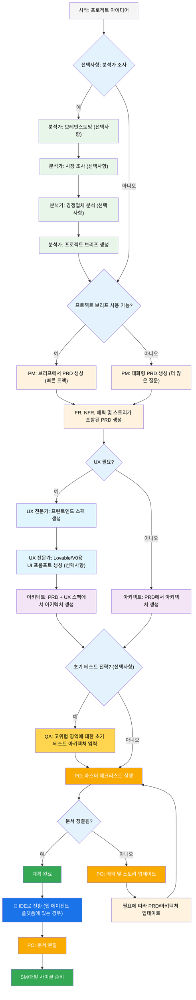

# BMad 방법론 — 사용자 가이드

이 가이드는 애자일 AI 기반 계획 및 개발을 위한 BMad 방법론을 이해하고 효과적으로 사용하는 데 도움이 됩니다.

## BMad 계획 및 실행 워크플로우

먼저 완전한 표준 그린필드 계획 + 실행 워크플로우입니다. 브라운필드는 매우 유사하지만, 브라운필드 프로젝트를 다루기 전에 이 그린필드를 먼저 이해하는 것이 좋습니다. 간단한 프로젝트라도 마찬가지입니다. BMad 방법론은 새 프로젝트 폴더의 루트에 설치되어야 합니다. 계획 단계의 경우, 강력한 웹 에이전트와 함께 선택적으로 수행할 수 있으며, 이는 일부 에이전트 도구에서 자체 API 키나 크레딧을 제공하는 경우보다 훨씬 적은 비용으로 더 높은 품질의 결과를 얻을 수 있습니다. 계획을 위해서는 강력한 사고 모델과 더 큰 컨텍스트, 그리고 에이전트와의 파트너십으로 작업하는 것이 최상의 결과를 얻습니다.

기존 프로젝트(브라운필드 프로젝트)에서 BMad 방법론을 사용할 경우, **[브라운필드에서 작업하기](./working-in-the-brownfield.md)**를 검토하세요.

아래 다이어그램이 렌더링되지 않는 경우, VSCode(또는 포크된 클론 중 하나)에 Markdown All in One과 Markdown Preview Mermaid Support 플러그인을 설치하세요. 이 플러그인들과 함께 열려 있을 때 탭에서 마우스 오른쪽 버튼을 클릭하면 미리 보기 열기 옵션이 있거나 IDE 문서를 확인하세요.

### 계획 워크플로우 (웹 UI 또는 강력한 IDE 에이전트)

개발이 시작되기 전에 BMad는 비용 효율성을 위해 이상적으로 웹 UI에서 수행되는 구조화된 계획 워크플로우를 따릅니다:



#### 웹 UI에서 IDE로의 전환

**중요한 전환점**: PO가 문서 정렬을 확인한 후, 개발 워크플로우를 시작하기 위해 웹 UI에서 IDE로 전환해야 합니다:

1. **프로젝트에 문서 복사**: `docs/prd.md`와 `docs/architecture.md`가 프로젝트의 docs 폴더(또는 설치 중에 지정할 수 있는 커스텀 위치)에 있는지 확인
2. **IDE로 전환**: 선호하는 에이전트 IDE에서 프로젝트 열기
3. **문서 분할**: PO 에이전트를 사용하여 PRD를 분할한 다음 아키텍처 분할
4. **개발 시작**: 다음에 오는 핵심 개발 사이클 시작

#### 계획 산출물 (표준 경로)

```text
PRD              → docs/prd.md
아키텍처          → docs/architecture.md
분할된 에픽       → docs/epics/
분할된 스토리     → docs/stories/
QA 평가          → docs/qa/assessments/
QA 게이트        → docs/qa/gates/
```

### 핵심 개발 사이클 (IDE)

계획이 완료되고 문서가 분할되면, BMad는 구조화된 개발 워크플로우를 따릅니다:

```mermaid
graph TD
    A["개발 단계 시작"] --> B["SM: 이전 스토리 개발/QA 노트 검토"]
    B --> B2["SM: 분할된 에픽 + 아키텍처에서 다음 스토리 초안 작성"]
    B2 --> S{"고위험 스토리? (선택사항)"}
    S -->|예| T["QA: 초안 스토리에 *risk + *design"]
    S -->|아니오| B3
    T --> U["테스트 전략 및 위험 프로필 생성"]
    U --> B3{"PO: 스토리 초안 검증 (선택사항)"}
    B3 -->|검증 요청됨| B4["PO: 산출물에 대해 스토리 검증"]
    B3 -->|검증 건너뛰기| C{"사용자 승인"}
    B4 --> C
    C -->|승인됨| D["개발: 순차적 작업 실행"]
    C -->|변경 필요| B2
    D --> E["개발: 작업 + 테스트 구현"]
    E --> V{"개발 중 QA 확인? (선택사항)"}
    V -->|예| W["QA: 조기 검증을 위한 *trace 또는 *nfr"]
    V -->|아니오| F
    W --> X["개발: 커버리지/NFR 격차 해결"]
    X --> F["개발: 모든 검증 실행"]
    F --> G["개발: 검토 준비 완료로 표시 + 노트 추가"]
    G --> H{"사용자 검증"}
    H -->|QA 검토 요청| I["QA: 테스트 아키텍트 검토 + 품질 게이트"]
    H -->|QA 없이 승인| M["중요: 모든 회귀 테스트 및 린팅이 통과하는지 확인"]
    I --> J["QA: 테스트 아키텍처 분석 + 활성 리팩토링"]
    J --> L{"QA 결정"}
    L -->|개발 작업 필요| D
    L -->|승인됨| M
    H -->|수정 필요| D
    M --> N["중요: 진행하기 전에 변경사항을 커밋하세요!"]
    N --> Y{"게이트 업데이트 필요?"}
    Y -->|예| Z["QA: 상태 업데이트를 위한 *gate"]
    Y -->|아니오| K
    Z --> K["스토리를 완료로 표시"]
    K --> B

    style A fill:#f5f5f5,color:#000
    style B fill:#e8f5e9,color:#000
    style B2 fill:#e8f5e9,color:#000
    style S fill:#e3f2fd,color:#000
    style T fill:#ffd54f,color:#000
    style U fill:#ffd54f,color:#000
    style B3 fill:#e3f2fd,color:#000
    style B4 fill:#fce4ec,color:#000
    style C fill:#e3f2fd,color:#000
    style D fill:#e3f2fd,color:#000
    style E fill:#e3f2fd,color:#000
    style V fill:#e3f2fd,color:#000
    style W fill:#ffd54f,color:#000
    style X fill:#e3f2fd,color:#000
    style F fill:#e3f2fd,color:#000
    style G fill:#e3f2fd,color:#000
    style H fill:#e3f2fd,color:#000
    style I fill:#f9ab00,color:#fff
    style J fill:#ffd54f,color:#000
    style K fill:#34a853,color:#fff
    style L fill:#e3f2fd,color:#000
    style M fill:#ff5722,color:#fff
    style N fill:#d32f2f,color:#fff
    style Y fill:#e3f2fd,color:#000
    style Z fill:#ffd54f,color:#000
```



## 전제 조건

BMad 방법론을 설치하기 전에 다음을 확인하세요:

- **Node.js** ≥ 18, **npm** ≥ 9
- **Git** 설치 및 구성됨
- **(선택사항)** "Markdown All in One" + "Markdown Preview Mermaid Support" 확장이 있는 VS Code

## 설치

### 선택사항

Claude(Sonnet 4 또는 Opus), Gemini Gem(2.5 Pro) 또는 Custom GPT와 함께 웹에서 계획을 수행하려면:

1. `dist/teams/`로 이동
2. `team-fullstack.txt` 복사
3. 새 Gemini Gem 또는 CustomGPT 생성
4. 다음 지침과 함께 파일 업로드: "귀하의 중요한 운영 지침이 첨부되어 있으며, 지시된 대로 캐릭터를 벗어나지 마세요"
5. `/help`를 입력하여 사용 가능한 명령 확인

### IDE 프로젝트 설정

```bash
# 대화형 설치 (권장)
npx bmad-method install
```

### Codex (CLI 및 웹)

BMAD는 `AGENTS.md`와 커밋된 핵심 에이전트 파일을 통해 OpenAI Codex와 통합됩니다.

- 두 가지 설치 모드:
  - Codex (로컬 전용): 로컬 개발을 위해 `.bmad-core/`를 무시된 상태로 유지
    - `npx bmad-method install -f -i codex -d .`
  - Codex 웹 활성화: Codex 웹용 커밋을 위해 `.bmad-core/`가 추적되도록 보장
    - `npx bmad-method install -f -i codex-web -d .`

- 생성되는 것:
  - 다음을 포함하는 BMAD 섹션이 있는 프로젝트 루트의 `AGENTS.md`
    - Codex 사용 방법 (CLI 및 웹)
    - 에이전트 디렉토리 (제목, ID, 사용 시기)
    - 소스 경로, 사용 시기, 활성화 문구 및 YAML이 포함된 에이전트별 세부 섹션
    - 빠른 사용 노트가 있는 작업
  - `package.json`이 존재하는 경우 유용한 스크립트가 추가됨:
    - `bmad:refresh`, `bmad:list`, `bmad:validate`

- Codex 사용:
  - CLI: 프로젝트 루트에서 `codex`를 실행하고 자연스럽게 프롬프트 입력 (예: "개발자로서, ...를 구현하세요")
  - 웹: `.bmad-core/`와 `AGENTS.md`를 커밋한 다음 Codex에서 저장소를 열고 같은 방식으로 프롬프트 입력

- 변경 후 새로 고침:
  - `AGENTS.md`의 BMAD 블록을 업데이트하려면 적절한 설치 모드(`codex` 또는 `codex-web`)를 다시 실행

## 특수 에이전트

BMad 에이전트는 두 개가 있으며, 향후 단일 BMad-Master로 통합될 예정입니다.

### BMad-Master

이 에이전트는 실제 스토리 구현을 제외하고 다른 모든 에이전트가 할 수 있는 모든 작업이나 명령을 수행할 수 있습니다. 또한 이 에이전트는 웹에서 지식 베이스에 액세스하고 프로세스에 대해 무엇이든 설명함으로써 BMad 방법론을 설명하는 데 도움을 줄 수 있습니다.

개발자 외에 다른 에이전트 간 전환을 귀찮아하지 않으려면 이 에이전트가 적합합니다. 컨텍스트가 증가함에 따라 에이전트 성능이 저하되므로, 에이전트에게 대화를 압축하고 압축된 대화를 초기 메시지로 하여 새 대화를 시작하도록 지시하는 것이 중요합니다. 각 스토리가 구현된 후 자주 이를 수행하세요.

### BMad-Orchestrator

이 에이전트는 IDE 내에서 사용해서는 안 됩니다. 이는 많은 컨텍스트를 활용하고 다른 에이전트로 변형할 수 있는 무거운 특수 목적 에이전트입니다. 이는 웹 번들 내의 팀을 촉진하기 위해서만 존재합니다. 웹 번들을 사용하면 BMad Orchestrator가 인사합니다.

### 에이전트 작동 방식

#### 의존성 시스템

각 에이전트는 의존성을 정의하는 YAML 섹션을 가지고 있습니다:

```yaml
dependencies:
  templates:
    - prd-template.md
    - user-story-template.md
  tasks:
    - create-doc.md
    - shard-doc.md
  data:
    - bmad-kb.md
```

**핵심 사항:**

- 에이전트는 필요한 리소스만 로드 (린 컨텍스트)
- 번들링 중에 의존성이 자동으로 해결됨
- 리소스는 일관성을 유지하기 위해 에이전트 간에 공유됨

#### 에이전트 상호작용

**IDE에서:**

```bash
# Cursor나 Windsurf 같은 일부 IDE는 수동 규칙을 사용하므로 '@' 기호로 상호작용
@pm 작업 관리 앱용 PRD 생성
@architect 시스템 아키텍처 설계
@dev 사용자 인증 구현

# Claude Code 같은 일부 IDE는 대신 슬래시 명령 사용
/pm 사용자 스토리 생성
/dev 로그인 버그 수정
```

#### 대화형 모드

- **점진적 모드**: 사용자 입력이 있는 단계별 진행
- **YOLO 모드**: 최소한의 상호작용으로 빠른 생성

## IDE 통합

### IDE 모범 사례

- **컨텍스트 관리**: 관련 파일만 컨텍스트에 유지, 파일을 가능한 한 간결하고 집중적으로 유지
- **에이전트 선택**: 작업에 적합한 에이전트 사용
- **반복 개발**: 작고 집중된 작업으로 작업
- **파일 구성**: 깔끔한 프로젝트 구조 유지
- **정기적 커밋**: 작업을 자주 저장

## 테스트 아키텍트 (QA 에이전트)

### 개요

BMad의 QA 에이전트는 단순한 "시니어 개발자 리뷰어"가 아니라 테스트 전략, 품질 게이트, 위험 기반 테스트에 대한 깊은 전문 지식을 가진 **테스트 아키텍트**입니다. Quinn이라는 이름의 이 에이전트는 안전할 때 코드를 적극적으로 개선하면서 품질 문제에 대한 자문 권한을 제공합니다.

#### 빠른 시작 (필수 명령)

```bash
@qa *risk {story}       # 개발 전 위험 평가
@qa *design {story}     # 테스트 전략 생성
@qa *trace {story}      # 개발 중 테스트 커버리지 확인
@qa *nfr {story}        # 품질 속성 확인
@qa *review {story}     # 전체 평가 → 게이트 작성
```

#### 명령 별칭 (테스트 아키텍트)

문서는 편의를 위해 짧은 형태를 사용합니다. 두 스타일 모두 유효합니다:

```text
*risk    → *risk-profile
*design  → *test-design
*nfr     → *nfr-assess
*trace   → *trace-requirements (또는 그냥 *trace)
*review  → *review
*gate    → *gate
```

### 핵심 기능

#### 1. 위험 프로파일링 (`*risk`)

**언제:** 스토리 초안 후, 개발 시작 전 (가장 이른 개입 지점)

구현 위험을 식별하고 평가합니다:

- **카테고리**: 기술적, 보안, 성능, 데이터, 비즈니스, 운영
- **채점**: 확률 × 영향 분석 (1-9 척도)
- **완화**: 식별된 각 위험에 대한 구체적 전략
- **게이트 영향**: 위험 ≥9는 FAIL 트리거, ≥6은 CONCERNS 트리거 (권위 있는 규칙은 `tasks/risk-profile.md` 참조)

#### 2. 테스트 설계 (`*design`)

**언제:** 스토리 초안 후, 개발 시작 전 (작성할 테스트 안내)

다음을 포함한 포괄적인 테스트 전략을 생성합니다:

- 각 수용 기준에 대한 테스트 시나리오
- 적절한 테스트 레벨 권장사항 (단위 vs 통합 vs E2E)
- 위험 기반 우선순위 지정 (P0/P1/P2)
- 테스트 데이터 요구사항 및 모의 전략
- CI/CD 통합을 위한 실행 전략

**예시 출력:**

```yaml
test_summary:
  total: 24
  by_level:
    unit: 15
    integration: 7
    e2e: 2
  by_priority:
    P0: 8 # 필수 - 중요한 위험과 연결
    P1: 10 # 권장 - 중간 위험
    P2: 6 # 있으면 좋음 - 낮은 위험
```

#### 3. 요구사항 추적 (`*trace`)

**언제:** 개발 중 (구현 중간 체크포인트)

요구사항을 테스트 커버리지에 매핑합니다:

- 각 수용 기준을 검증하는 테스트를 문서화
- 명확성을 위해 Given-When-Then 사용 (문서화만, BDD 코드 아님)
- 심각도 등급으로 커버리지 격차 식별
- 감사 목적을 위한 추적성 매트릭스 생성

#### 4. NFR 평가 (`*nfr`)

**언제:** 개발 중 또는 초기 검토 (품질 속성 검증)

비기능적 요구사항을 검증합니다:

- **핵심 4개**: 보안, 성능, 신뢰성, 유지보수성
- **증거 기반**: 실제 구현 증거 검색
- **게이트 통합**: NFR 실패는 품질 게이트에 직접 영향

#### 5. 포괄적 테스트 아키텍처 검토 (`*review`)

**언제:** 개발 완료 후, 스토리가 "검토 준비"로 표시된 후

`@qa *review {story}`를 실행하면 Quinn이 다음을 수행합니다:

- **요구사항 추적성**: 모든 수용 기준을 검증하는 테스트에 매핑
- **테스트 레벨 분석**: 단위, 통합, E2E 레벨에서 적절한 테스트 보장
- **커버리지 평가**: 격차 및 중복 테스트 커버리지 식별
- **활성 리팩토링**: 안전할 때 코드 품질을 직접 개선
- **품질 게이트 결정**: 발견 사항에 기반하여 PASS/CONCERNS/FAIL 상태 발급

#### 6. 품질 게이트 (`*gate`)

**언제:** 검토 수정 후 또는 게이트 상태 업데이트가 필요할 때

품질 게이트 결정을 관리합니다:

- **결정적 규칙**: PASS/CONCERNS/FAIL을 위한 명확한 기준
- **병렬 권한**: QA가 `docs/qa/gates/`의 게이트 파일 소유
- **자문 성격**: 권장사항 제공, 차단하지 않음
- **면제 지원**: 필요할 때 수용된 위험 문서화

**참고:** 게이트는 자문적입니다. 팀이 품질 기준을 선택합니다. WAIVED는 이유, 승인자, 만료 날짜가 필요합니다. 스키마는 `templates/qa-gate-tmpl.yaml`, 게이트 규칙은 `tasks/review-story.md`, 채점은 `tasks/risk-profile.md`를 참조하세요.

### 테스트 아키텍트와 함께 작업하기

#### BMad 워크플로우와의 통합

테스트 아키텍트는 전체 개발 라이프사이클에 걸쳐 가치를 제공합니다. 각 기능을 언제 어떻게 활용할지는 다음과 같습니다:

| **단계**          | **명령** | **사용 시기**         | **가치**                  | **출력**                                                     |
| ------------------ | ----------- | ----------------------- | -------------------------- | -------------------------------------------------------------- |
| **스토리 초안 작성** | `*risk`     | SM이 스토리 초안 작성 후   | 함정을 조기에 식별    | `docs/qa/assessments/{epic}.{story}-risk-{YYYYMMDD}.md`        |
|                    | `*design`   | 위험 평가 후   | 테스트 전략에 대한 개발 안내 | `docs/qa/assessments/{epic}.{story}-test-design-{YYYYMMDD}.md` |
| **개발**    | `*trace`    | 구현 중간      | 테스트 커버리지 확인       | `docs/qa/assessments/{epic}.{story}-trace-{YYYYMMDD}.md`       |
|                    | `*nfr`      | 기능 구축 중 | 품질 문제를 조기에 파악 | `docs/qa/assessments/{epic}.{story}-nfr-{YYYYMMDD}.md`         |
| **검토**         | `*review`   | 스토리 완료 표시 시   | 전체 품질 평가    | 스토리의 QA 결과 + 게이트 파일                                |
| **검토 후**    | `*gate`     | 문제 수정 후     | 품질 결정 업데이트    | 업데이트된 `docs/qa/gates/{epic}.{story}-{slug}.yml`              |

#### 예시 명령

```bash
# 계획 단계 - 개발 시작 전에 실행
@qa *risk {draft-story}     # 무엇이 잘못될 수 있나?
@qa *design {draft-story}   # 어떤 테스트를 작성해야 하나?

# 개발 단계 - 코딩 중에 실행
@qa *trace {story}          # 모든 것을 테스트하고 있나?
@qa *nfr {story}            # 품질 표준을 충족하고 있나?

# 검토 단계 - 개발 완료 시 실행
@qa *review {story}         # 포괄적 평가 + 리팩토링

# 검토 후 - 문제 해결 후 실행
@qa *gate {story}           # 게이트 상태 업데이트
```

### 시행되는 품질 표준

Quinn은 다음 테스트 품질 원칙을 시행합니다:

- **플래키 테스트 없음**: 적절한 비동기 처리를 통한 신뢰성 보장
- **하드 대기 없음**: 동적 대기 전략만
- **상태 없음 및 병렬 안전**: 테스트가 독립적으로 실행
- **자체 정리**: 테스트가 자체 테스트 데이터 관리
- **적절한 테스트 레벨**: 로직은 단위, 상호작용은 통합, 여정은 E2E
- **명시적 어설션**: 어설션은 테스트에, 헬퍼에는 두지 않음

### 게이트 상태 의미

- **PASS**: 모든 중요한 요구사항 충족, 차단 문제 없음
- **CONCERNS**: 중요하지 않은 문제 발견, 팀이 검토해야 함
- **FAIL**: 해결해야 할 중요한 문제 (보안 위험, P0 테스트 누락)
- **WAIVED**: 문제는 인정되지만 팀이 명시적으로 수용

### 특수 상황

**고위험 스토리:**

- 개발 시작 전에 항상 `*risk`와 `*design` 실행
- 개발 중 `*trace`와 `*nfr` 체크포인트 고려

**복잡한 통합:**

- 모든 통합 지점이 테스트되도록 개발 중 `*trace` 실행
- 통합 간 성능을 검증하기 위해 `*nfr`로 후속 조치

**성능 중요:**

- 개발 중 `*nfr`을 이르고 자주 실행
- 성능 문제를 발견하기 위해 검토까지 기다리지 마세요

**브라운필드/레거시 코드:**

- 회귀 위험을 식별하기 위해 `*risk`로 시작
- 하위 호환성에 특별히 집중하여 `*review` 사용

### 모범 사례

- **조기 참여**: 스토리 초안 작성 중 `*design`과 `*risk` 실행
- **위험 기반 집중**: 위험 점수가 테스트 우선순위를 주도하도록 함
- **반복적 개선**: QA 피드백을 사용하여 향후 스토리 개선
- **게이트 투명성**: 게이트 결정을 팀과 공유
- **지속적 학습**: QA가 팀 지식 공유를 위한 패턴 문서화
- **브라운필드 관리**: 기존 시스템의 회귀 위험에 특별한 주의

### 출력 경로 참조

테스트 아키텍트 출력이 저장되는 위치에 대한 빠른 참조:

```text
*risk-profile  → docs/qa/assessments/{epic}.{story}-risk-{YYYYMMDD}.md
*test-design   → docs/qa/assessments/{epic}.{story}-test-design-{YYYYMMDD}.md
*trace         → docs/qa/assessments/{epic}.{story}-trace-{YYYYMMDD}.md
*nfr-assess    → docs/qa/assessments/{epic}.{story}-nfr-{YYYYMMDD}.md
*review        → 스토리의 QA 결과 섹션 + 게이트 파일 참조
*gate          → docs/qa/gates/{epic}.{story}-{slug}.yml
```

## 기술적 선호도 시스템

BMad는 `.bmad-core/data/`에 위치한 `technical-preferences.md` 파일을 통한 개인화 시스템을 포함합니다. 이는 PM과 아키텍트가 설계 패턴, 기술 선택 또는 여기에 넣고 싶은 다른 모든 것에 대한 선호도를 권장하도록 편향시키는 데 도움이 될 수 있습니다.

### 웹 번들과 함께 사용

커스텀 웹 번들을 만들거나 AI 플랫폼에 업로드할 때, 에이전트가 대화 시작부터 선호도를 갖도록 `technical-preferences.md` 내용을 포함하세요.

## 핵심 구성

`bmad-core/core-config.yaml` 파일은 BMad가 다양한 프로젝트 구조와 원활하게 작동할 수 있게 하는 중요한 구성입니다. 향후 더 많은 옵션이 제공될 예정입니다. 현재 가장 중요한 것은 yaml의 devLoadAlwaysFiles 목록 섹션입니다.

### 개발자 컨텍스트 파일

개발 에이전트가 항상 로드해야 할 파일을 정의합니다:

```yaml
devLoadAlwaysFiles:
  - docs/architecture/coding-standards.md
  - docs/architecture/tech-stack.md
  - docs/architecture/project-structure.md
```

아키텍처를 분할하여 이러한 문서가 존재하고, 가능한 한 간결하며, 개발 에이전트가 항상 컨텍스트에 로드하기를 원하는 정확한 정보를 포함하고 있는지 확인해야 합니다. 이것들이 에이전트가 따를 규칙입니다.

프로젝트가 성장하고 코드가 일관된 패턴을 구축하기 시작하면, 코딩 표준은 에이전트가 여전히 시행해야 하는 표준만 포함하도록 줄여야 합니다. 에이전트는 파일의 주변 코드를 보고 현재 작업과 관련된 코딩 표준을 추론할 것입니다.

## 도움 받기

- **Discord 커뮤니티**: [Discord 참가](https://discord.gg/gk8jAdXWmj)
- **GitHub 이슈**: [버그 신고](https://github.com/bmadcode/bmad-method/issues)
- **문서**: [문서 탐색](https://github.com/bmadcode/bmad-method/docs)
- **YouTube**: [BMadCode 채널](https://www.youtube.com/@BMadCode)

## 결론

기억하세요: BMad는 개발 프로세스를 향상시키기 위해 설계되었으며, 전문 지식을 대체하지 않습니다. 설계 결정과 구현 세부사항에 대한 통제를 유지하면서 프로젝트를 가속화하는 강력한 도구로 사용하세요.